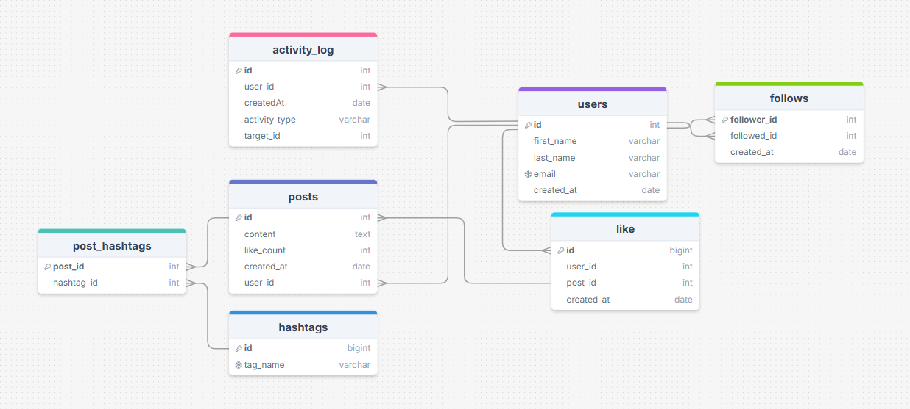

<body>

  <h1>📊 Social Media App Database Schema</h1>
  

  <h2>🧩 Entity Relationships</h2>

  <h3>User</h3>
  <ul>
    <li><strong>1:N with Post</strong> — A user can create many posts.</li>
    <li><strong>1:N with ActivityLog</strong> — A user can perform many activities.</li>
    <li><strong>1:N (self-referencing via Follows)</strong> — A user can follow and be followed by many users.</li>
    <li><strong>1:N with Follows</strong> as follower and followed.</li>
  </ul>

  <h3>Post</h3>
  <ul>
    <li><strong>N:1 with User</strong> — Each post belongs to one user.</li>
    <li><strong>1:N with Like</strong> — A post can have many likes.</li>
    <li><strong>N:M with Hashtag via <code>post_hashtags</code></strong> — A post can contain many hashtags and a hashtag can belong to many posts.</li>
  </ul>

  <h3>Hashtag</h3>
  <ul>
    <li><strong>N:M with Post</strong> — A hashtag can be linked to multiple posts via the <code>post_hashtags</code> join table.</li>
  </ul>

  <h3>ActivityLog</h3>
  <ul>
    <li><strong>N:1 with User</strong> — Each activity is performed by a single user.</li>
    <li><code>target_id</code> may refer to different entities (e.g., posts or users), but no strict foreign key constraint is enforced in this schema.</li>
  </ul>

  <h3>UserFollow</h3>
  <ul>
    <li><strong>Composite Primary Key:</strong> (<code>follower_id</code>, <code>followed_id</code>)</li>
    <li><strong>N:1 with User</strong> — Represents a many-to-many self-referencing relationship where users can follow each other.</li>
  </ul>
  <h2>🧩Indexing Strategy for Performance Optimization</h2>
    <h3>1. <code>users</code> Table</h3>
    <ul>
        <li><code>email</code> (<strong>UNIQUE</strong>): This is excellent for ensuring data integrity and fast lookups for users by their email address.</li>
        <li><code>id</code> (<strong>PRIMARY KEY</strong>): This is the default index and is efficient for retrieving user records by their ID.</li>
    </ul>
    <h3>2. <code>posts</code> Table</h3>
    <ul>
        <li><code>(created_at,user_id)</code>: This composite index optimizes queries that filter posts by a user and then order them by creation time; this is very efficient for user timelines.</li>
        <li><code>id</code> (<strong>PRIMARY KEY</strong>): As the primary key, this is indexed by default.</li>
    </ul>
    <h3>3. <code>follows</code> Table</h3>
    <ul>
        <li><code>followed_id</code>: This index accelerates queries to find users who are following a given user.</li>
    </ul>
    <h3>4. <code>like</code> Table</h3>
    <ul>
        <li><code>(post_id, user_id)</code> (<strong>UNIQUE</strong>): This composite index optimizes queries that check if a user has already liked a post and prevents duplicate likes.</li>
        <li><code>id</code> (<strong>PRIMARY KEY</strong>): The primary key is indexed by default.</li>
    </ul>
    <h3>5. <code>hashtags</code> Table</h2>
    <ul>
        <li><code>tag_name</code> (<strong>UNIQUE</strong>): This index enables fast lookups for hashtags and ensures that hashtag names are unique.</li>
        <li><code>id</code> (<strong>PRIMARY KEY</strong>): The primary key is indexed by default.</li>
    </ul>
    <h3>6. <code>activity_log</code> Table</h3>
    <ul>
        <li><code>(user_id, createdAt, activityType)</code>: This composite index optimizes fetching a user's activity feed, ordered by time and activity type.</li>
        <li><code>id</code> (<strong>PRIMARY KEY</strong>): The primary key is indexed by default.</li>
    </ul>
    </ul>
      <h2>Scalability Considerations</h2>
     <h3>Partitioning the activity_log Table</h3>
         <ul>
        <li> This table can grow very quickly.</li>
        <li>Consider partitioning the table by date or using a time-series database if you need to store a very high volume of activity logs.</li>
        <li> Implement a strategy for archiving or deleting old activity logs to prevent the table from growing indefinitely.</li>
    </ul>
  
</body>
</html>
